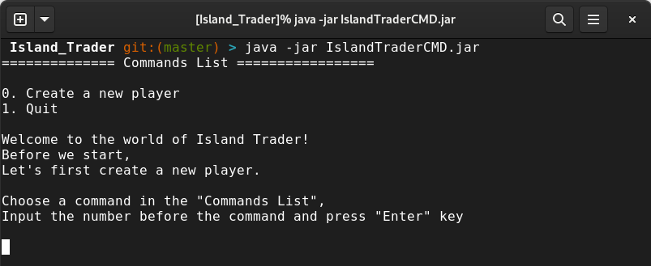
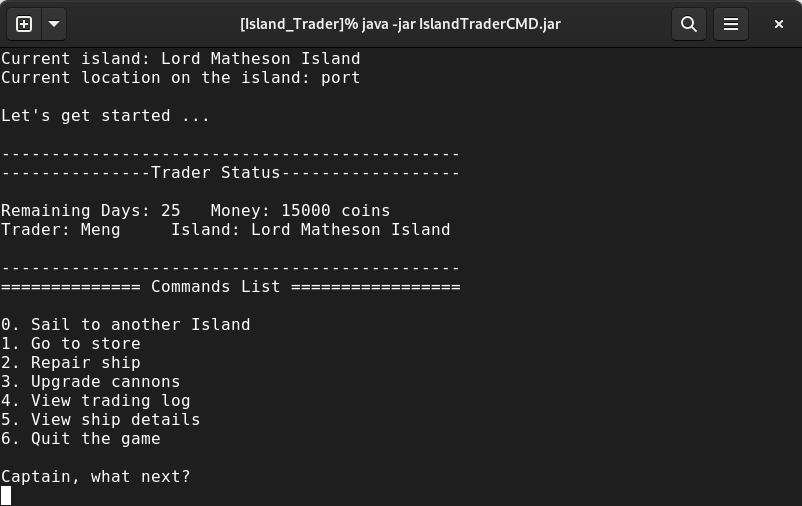
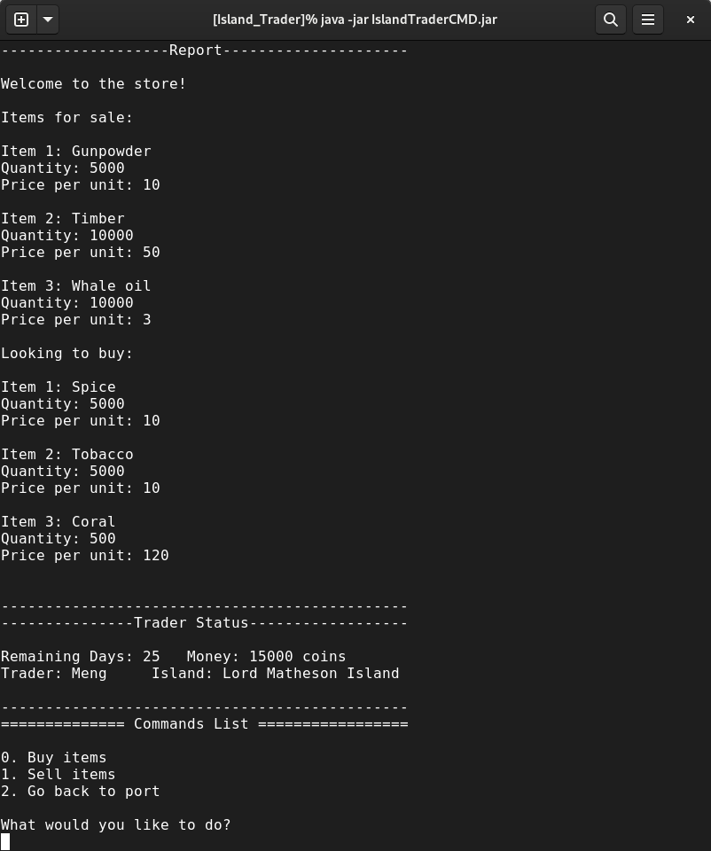
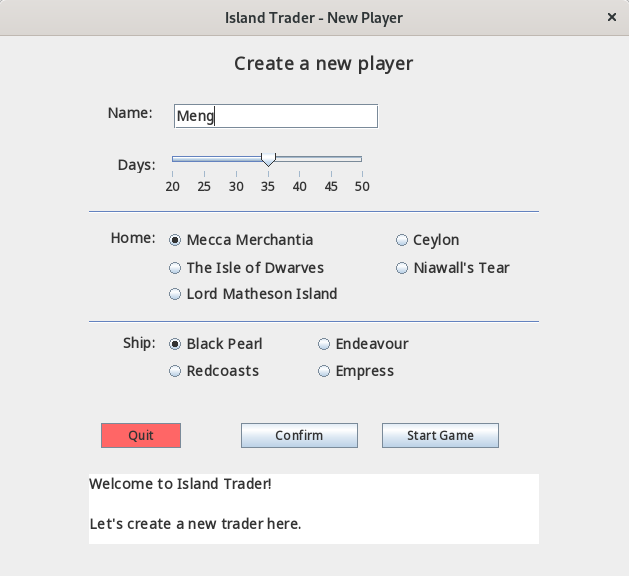
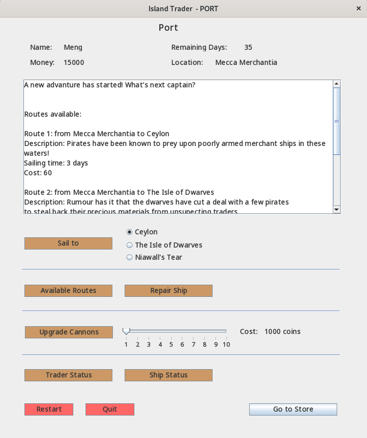
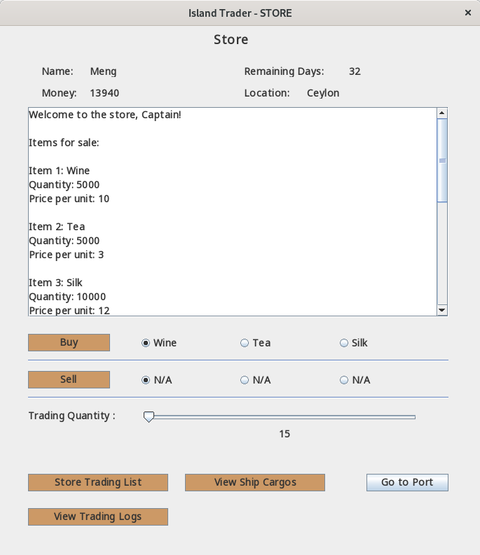

# Island Trader

## Introduction
Island Trader is a text-based voyage trading game in which you are a trader who travels by ship to trade goods on multiple islands. You will keep traveling between islands and trading goods with the goal to earn as much profit as possible before the game ends.

## How to run the command-line version of the game?

1. Ensure Java 11 or higher is installed.
2. Run <code>java -jar islandTraderCMD.jar</code>.

## How to run the GUI version of the game?

1. Ensure Java 11 or higher is installed.
2. Run <code>java -jar islandTraderGUI.jar</code>.

## Game Screenshots

### Command-line version:

### GUI version:

